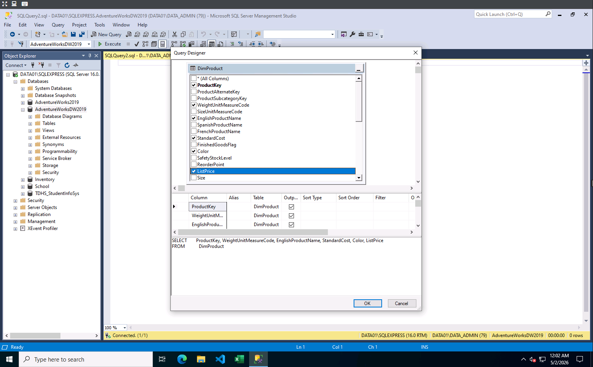
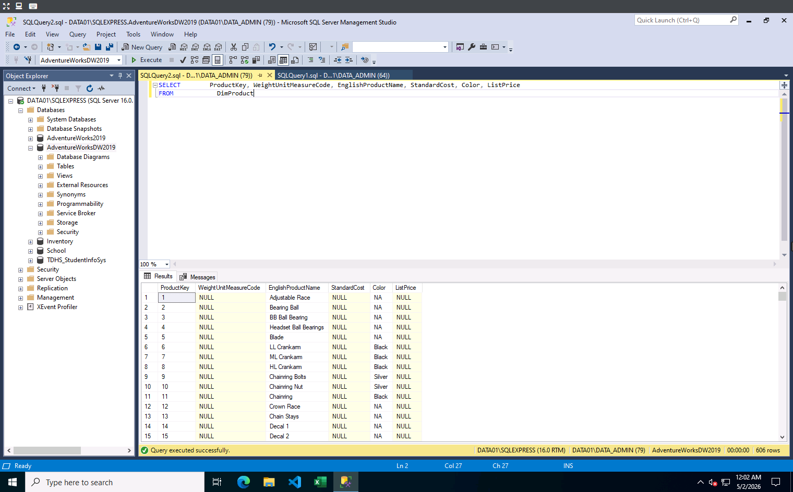
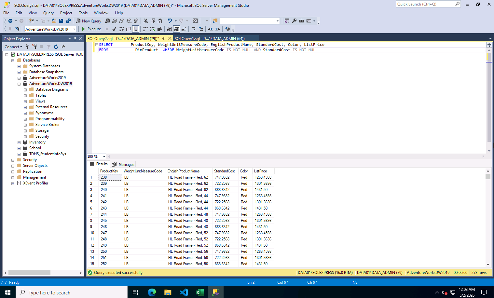
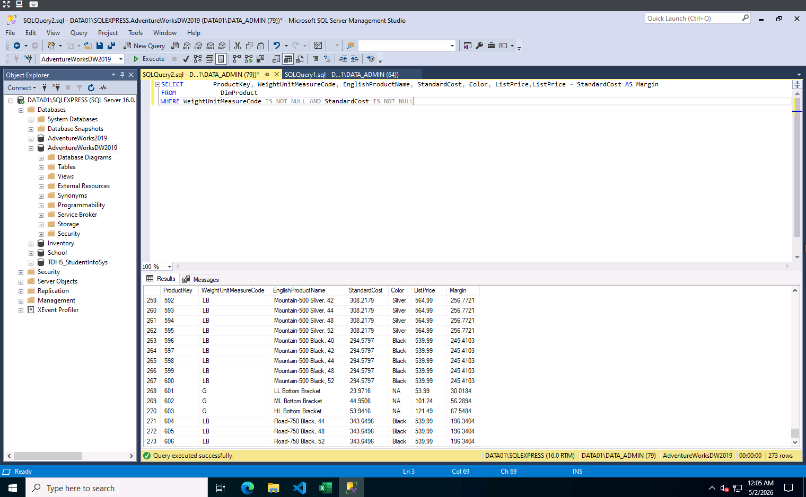
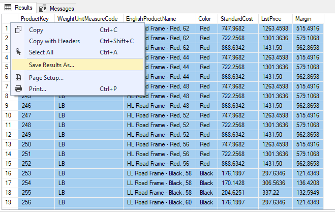

# 16.2.4 Live Lab: Build an Ad-Hoc Report

## 🎯 วัตถุประสงค์ของแล็บ (Lab Objective)
จำลองสถานการณ์จริงในโลกธุรกิจที่ต้องสร้างรายงานเฉพาะกิจ (Ad-Hoc Report) แบบเร่งด่วน เพื่อตอบคำถามหรือข้อสงสัยเฉพาะเจาะจงจากผู้บริหารหรือทีมงาน (เช่น การวิเคราะห์ข้อมูลต้นทุนและส่วนต่างกำไรของสินค้าแต่ละตัว) โดยไม่ต้องพึ่งพารายงานมาตรฐาน (Standardized Dashboard) อาศัยการดึงข้อมูลจาก Database โดยตรงเพื่อให้ได้คำตอบที่รวดเร็ว แม่นยำ และพร้อมสำหรับการตัดสินใจ (Actionable Insights)

---

## 🛠️ ขั้นตอนการลงมือทำและอธิบายภาพการทำงาน (Step-by-Step Execution)

การทำแล็บนี้ผ่านโปรแกรม SQL Server Management Studio (SSMS) ได้จำลองกระบวนการดึงข้อมูล (Data Extraction) และการแปลงข้อมูล (Data Transformation) เบื้องต้น โดยมีรายละเอียดแต่ละขั้นตอนดังนี้:

### ขั้นตอนที่ 1: การกำหนดขอบเขตและเลือกข้อมูลเป้าหมาย (Column Selection)

*   **สิ่งที่ทำ:** เริ่มต้นด้วยการใช้เครื่องมือ **Query Designer** (หน้าต่าง GUI) เพื่อสำรวจโครงสร้างของตาราง `DimProduct`
*   **หลักการทาง Data:** แทนที่จะดึงข้อมูลมาทั้งหมดทุกคอลัมน์ (ซึ่งทำให้เปลืองทรัพยากรประมวลผลและอ่านยาก) เราทำการติ๊กเลือกเฉพาะฟิลด์ที่ตอบโจทย์คำถามทางธุรกิจ ได้แก่ `ProductKey`, `WeightUnitMeasureCode`, `EnglishProductName`, `StandardCost`, `Color`, และ `ListPrice` 
*   **ผลลัพธ์:** ระบบจะทำการสร้างโครงร่างคำสั่ง `SELECT` ให้โดยอัตโนมัติ ช่วยลดความผิดพลาดในการพิมพ์ชื่อคอลัมน์ (Syntax Error) และเพิ่มความรวดเร็วในการทำงาน

### ขั้นตอนที่ 2: การสำรวจและประเมินคุณภาพข้อมูลเบื้องต้น (Data Profiling & Discovery)

*   **สิ่งที่ทำ:** ทำการรัน (Execute) คำสั่ง `SELECT` ที่ได้จากขั้นตอนแรก เพื่อดูหน้าตาของข้อมูลดิบ (Raw Data)
*   **หลักการทาง Data:** ในหน้าต่าง Results แสดงให้เห็นว่าตารางนี้มีข้อมูลทั้งหมด **606 แถว (Rows)** แต่เมื่อสังเกตด้วยตาเปล่าจะพบปัญหา **Data Quality** ทันที นั่นคือมีค่า `NULL` (ค่าว่าง) ปรากฏอยู่เต็มไปหมดในคอลัมน์ `WeightUnitMeasureCode` (หน่วยน้ำหนัก) และ `StandardCost` (ต้นทุนมาตรฐาน)
*   **Insight ที่ได้:** ข้อมูลที่มีค่า `NULL` เหล่านี้อาจเป็นสินค้าที่เลิกผลิตไปแล้ว สินค้าที่ใช้ภายในองค์กร หรือเป็นความผิดพลาดจากการกรอกข้อมูล หากนำข้อมูลที่มีค่าว่างไปคำนวณกำไร จะทำให้ผลลัพธ์เป็น Null หรือ Error ทันที

### ขั้นตอนที่ 3: การทำความสะอาดและคัดกรองข้อมูล (Data Filtering & Cleaning)

*   **สิ่งที่ทำ:** เพิ่มเงื่อนไข (Condition) ต่อท้ายคำสั่งด้วย Clause `WHERE WeightUnitMeasureCode IS NOT NULL AND StandardCost IS NOT NULL`
*   **หลักการทาง Data:** เป็นการทำ Data Cleaning อย่างง่าย โดยสั่งให้ระบบกรองเอาเฉพาะแถวข้อมูลที่มี "หน่วยน้ำหนัก" **และ** "ต้นทุน" ระบุอยู่จริงเท่านั้น (ตัด Noise ออก)
*   **ผลลัพธ์:** จำนวนข้อมูลในหน้า Results ลดลงจาก 606 แถว เหลือเพียง **273 แถว** ซึ่งเป็นข้อมูลที่มีคุณภาพ (Clean Data) พร้อมสำหรับการนำไปวิเคราะห์ต่อในขั้นสูง 

### ขั้นตอนที่ 4: การสร้างตัวแปรใหม่ทางธุรกิจจากการคำนวณ (Derived Column & Business Value)

*   **สิ่งที่ทำ:** ปรับแต่งคำสั่ง `SELECT` เพิ่มเติม โดยใส่สมการทางคณิตศาสตร์ `ListPrice - StandardCost AS Margin` เข้าไปเป็นคอลัมน์สุดท้าย
*   **หลักการทาง Data:** การนำ ราคาขาย (ListPrice) มาลบด้วย ต้นทุน (StandardCost) คือสมการหา **"ส่วนต่างกำไร"** ส่วนคำสั่ง `AS Margin` คือการตั้งชื่อคอลัมน์ใหม่ที่เกิดขึ้นมานี้ (Aliasing) 
*   **Insight ที่ได้:** กระบวนการนี้เรียกว่า "การผลักภาระลอจิกไปที่ฐานข้อมูล (Pushing Logic to the Database)" เราได้ข้อมูล `Margin` ออกมาสำเร็จรูปทันทีใน SSMS (ดังที่เห็นตัวเลขกำไรในคอลัมน์ขวาสุด) โดยที่ผู้บริหารหรือทีมงานปลายทางสามารถนำตารางนี้ไปใช้งานต่อได้เลย ไม่ต้องไปเขียนสูตรใน Excel ให้ซ้ำซ้อนอีก

### ขั้นตอนที่ 5: การส่งออกข้อมูลเพื่อนำไปใช้งานต่อ (Data Export to CSV)

**คำอธิบายการทำงาน:**
*   **สิ่งที่ทำ:** หลังจากได้ผลลัพธ์ที่สมบูรณ์ในหน้าต่าง Results ให้ทำการคลิกขวาที่บริเวณตารางผลลัพธ์ เลือกคำสั่ง **"Save Results As..."** และเลือกบันทึกไฟล์เป็นนามสกุล **CSV (Comma Separated Values)**
*   **หลักการทาง Data:** ขั้นตอนนี้คือการส่งมอบผลลัพธ์ (Data Delivery) ไฟล์ CSV เป็นรูปแบบไฟล์มาตรฐานสากลที่มีขนาดเล็ก (Lightweight) เข้ากันได้กับทุกระบบปฏิบัติการ และไม่มีการติดฟอร์แมตที่ซับซ้อน 
*   **Insight ที่ได้:** การส่งออกเป็น CSV ทำให้ "ข้อมูลที่ผ่านการทำความสะอาดและคำนวณมาแล้ว" พร้อมสำหรับการส่งมอบให้ผู้บริหาร หรือให้ทีมงานนำไปเปิดในโปรแกรม Spreadsheet (เช่น Excel) เพื่อสร้างกราฟนำเสนอ (Data Visualization) ได้อย่างราบรื่นไร้รอยต่อ
---

## 🧠 สรุปสิ่งที่ได้เรียนรู้จากกระบวนการนี้ (Key Takeaways)

1.  **ความสำคัญของการตั้งคำถามกับข้อมูล (Interrogating the Data):** ก่อนจะคำนวณอะไร ต้องตรวจเช็กคุณภาพข้อมูล (Data Quality) ก่อนเสมอ การเห็น `NULL` ในขั้นตอนที่ 2 และรีบจัดการกรองออกในขั้นตอนที่ 3 คือหัวใจสำคัญที่ทำให้รายงานมีความน่าเชื่อถือ
2.  **ประสิทธิภาพของ SQL ในการเตรียมข้อมูล (ETL Basics):** การเขียนเงื่อนไขกรองข้อมูล (`WHERE`) และการสร้างคอลัมน์คำนวณใหม่ (`AS`) แสดงให้เห็นว่าเราสามารถทำ Data Transformation เบื้องต้นให้จบได้ตั้งแต่ระดับ Database ซึ่งทำงานได้เร็วกว่าการดึงข้อมูลดิบทั้งหมดไปทำในโปรแกรมอื่น
3.  **ความรวดเร็วเหนือความสวยงามในงานฉุกเฉิน (Agility for Ad-Hoc Requests):** สำหรับ Ad-Hoc Report ตัวเลขที่ถูกต้องและการตอบคำถามทางธุรกิจได้ตรงจุด (เช่น รู้ว่าสินค้าตัวไหนกำไรเท่าไหร่จากคอลัมน์ Margin) มีความสำคัญกว่ารูปแบบตารางที่สวยงาม ความเร็วในการใช้ Query Designer และ T-SQL จึงตอบโจทย์ข้อนี้ได้ดีที่สุด
