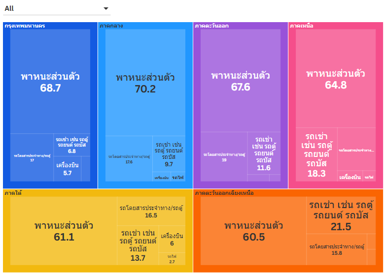

# 👋 I'm Kanokphorn Rungrattanapong

  

## 🤖 About Me
ดิฉันเป็นนักศึกษาชั้นปีที่ 3 สาขาปัญญาประดิษฐ์ (AI) มหาวิทยาลัยหัวเฉียวเฉลิมพระเกียรติ มีความเชี่ยวชาญด้าน Computer Vision และระบบการตรวจจับแบบ Real-time (Detection Pipelines) ดิฉันมีความกระตือรือร้นที่จะเรียนรู้เทคโนโลยีใหม่ๆ และพร้อมรับคำแนะนำจากผู้เชี่ยวชาญในอุตสาหกรรม โดยมีความมุ่งมั่นที่จะพัฒนาทักษะด้าน AI และหุ่นยนต์ เพื่อสร้างสรรค์โซลูชันที่ใช้งานได้จริงและมีประสิทธิภาพในสภาพแวดล้อมการทำงานระดับมืออาชีพ

🔭 สิ่งที่กำลังให้ความสนใจ: การเพิ่มประสิทธิภาพการแพ็คสินค้าขั้นสูงด้วยอัลกอริทึม Metaheuristics

🧠 ความสนใจด้านการวิจัย: การประมวลผลภาษาธรรมชาติ (RAG & TTS) และระบบป้องกันอัตโนมัติ (Autonomous Defense Systems)

⚡ เป้าหมายการทำงาน: มุ่งเน้นการพัฒนาระบบ AI ที่มีเสถียรภาพและประสิทธิภาพสูง พร้อมการเชื่อมต่อผ่านเว็บอินเทอร์เฟซที่ทันสมัย
  
---

# 🗄️ Data Storytelling: ถอดรหัสวิธีคิดของประชากรไทย ผ่าน "พาหนะ" ที่ใช้เดินทาง (พ.ศ. 2558-2560) 

มีบางครั้งที่ข้อมูลไม่ได้บอกเราเพียงแค่ว่า “อะไรเกิดขึ้น” แต่กลับทำหน้าที่เป็นเสมือนกระจกสะท้อนให้เห็นว่า “คนคิดอย่างไรและตัดสินใจอย่างไร” 

การวิเคราะห์ข้อมูล **"ร้อยละของประชากรที่เดินทางท่องเที่ยว จำแนกตามพาหนะที่ใช้ในการเดินทาง ภาคที่อยู่อาศัย และลักษณะการเดินทาง"** จากสำนักงานสถิติแห่งชาติ ในครั้งนี้ ไม่ได้เริ่มต้นจากการตั้งคำถามว่า “จะใช้กราฟอะไรให้สวยงาม” แต่เริ่มต้นจากคำถามว่า *"หากจำเป็นต้องออกแบบโครงสร้างพื้นฐานหรือบริการด้านการท่องเที่ยว ปัจจัยใดคือแกนกลางของพฤติกรรมผู้บริโภค?"*

งานนี้บูรณาการแนวคิดจากหนังสือ **"ภาพนิทัศน์จากข้อมูลในฐานะศิลปะเพื่อการใช้ประโยชน์"** ซึ่งระบุอย่างชัดเจนว่า ภาพนิทัศน์ที่เป็นศิลปะเพื่อการใช้งานนั้น มีภารกิจสำคัญในการให้ความรู้ สติ ปัญญาแก่สังคม หรือให้ความสว่างทางปัญญาแก่ผู้ชม ผนวกกับการเชื่อมโยงความรู้เชิงปฏิบัติการจาก:
* **11.1.6 Lab – Measures of Central Tendency:** การวิเคราะห์ข้อมูลด้วยสถิติพื้นฐาน (Mean, Median, Mode) เพื่อพิสูจน์ความเสถียรของพฤติกรรม
* **16.2.4 Live Lab – Build an Ad-Hoc Report:** การสร้างรายงานเฉพาะกิจเพื่อตอบคำถามทางธุรกิจอย่างรวดเร็ว

---

## 1. กรอบแนวคิดในการวิเคราะห์ (Analytical Framework)

การวิเคราะห์นี้ดำเนินตามกรอบ **Data → Information → Insight → Action** โดยตั้งเป้าหมายตามหลักการของ Ad-Hoc Report ว่า *"ถ้าผู้บริหารมีคำถามทางธุรกิจตอนนี้ ข้อมูลชุดนี้ต้องตอบได้ทันที"*

ตัวแปรหลักจากชุดข้อมูลที่นำมาใช้ในการออกแบบการเล่าเรื่อง มีดังนี้:

| ตัวแปรหลัก (Variables) | Field ในฐานข้อมูล | บทบาทในการเล่าเรื่อง (Storytelling Role) |
| :--- | :--- | :--- |
| **พาหนะ** | `vehicle_used` | ตัวแทนของ "ทรัพยากรที่ประชากรมี" |
| **ภูมิภาค** | `region` | ตัวแทนของ "บริบททางเศรษฐกิจและข้อจำกัดเชิงพื้นที่" |
| **ลักษณะทริป** | `type_travel` | ตัวแทนของ "เงื่อนไขที่มีผลต่อการตัดสินใจ" |
| **สัดส่วนร้อยละ** | `per_travel` | มาตรวัด "พฤติกรรมที่เกิดขึ้นจริง" |

---

## 2. การประยุกต์ใช้ Lab 11.1.6 กับข้อมูลจริง (Mean / Median / Mode)

หลักการสำคัญประการหนึ่งจาก Lab คือ ค่ากลางต้องทำหน้าที่ช่วยยืนยันพฤติกรรมที่เกิดขึ้นซ้ำ เมื่อนำมาคำนวณกับตัวแปร `vehicle_used` ในปี 2560 พบผลลัพธ์ที่น่าสนใจ:

| พาหนะ | Mean (%) | ความหมายเชิงพฤติกรรม |
| :--- | :--- | :--- |
| **รถยนต์ส่วนตัว** | ~65.7 | พฤติกรรมกระแสหลักที่เสถียรที่สุดของประเทศ |
| **รถโดยสารประจำทาง/รถตู้** | ~16.4 | ทางเลือกสำรองอันดับหนึ่ง |
| **รถเช่า (รถตู้/รถยนต์/รถบัส)** | ~14.4 | ทางเลือกที่มีนัยสำคัญในบางพื้นที่ |
| **เครื่องบิน** | ~2.3 | ทางเลือกเฉพาะเงื่อนไข (Long-distance/Time-sensitive) |

**ข้อค้นพบสำคัญ:** เมื่อพิจารณาค่ากลางพบว่า "รถยนต์ส่วนตัว" มีสัดส่วนที่โดดเด่นอย่างสม่ำเสมอในทุกปี (2558-2560) ซึ่งพิสูจน์ได้ว่านี่คือพฤติกรรมการเดินทางที่เสถียรที่สุดของคนไทย

---

## 3. ข้อค้นพบเชิงประจักษ์ (Empirical Insights)

### Insight 1: คนไทย “ขับรถไปเที่ยว” เป็นหลักในทุกภูมิภาค
จากการวิเคราะห์ภาพรวม พบว่าพาหนะส่วนตัวคือตัวเลือกหลักที่มีสัดส่วนสูงที่สุด โดยในบางภูมิภาคเช่น ภาคตะวันออก มีสัดส่วนสูงถึง **70.7%** สอดคล้องกับแนวคิดที่ว่าต้องทำให้สิ่งที่ครอบงำข้อมูลโดดเด่นที่สุดเพื่อให้ผู้ชมเข้าใจ "ภาพรวม" ได้ในทันที

### Insight 2: ภาคตะวันออกเฉียงเหนือกับความต้องการ "รถเช่า" ที่โดดเด่น
เมื่อวิเคราะห์เปรียบเทียบเชิงพื้นที่ พบว่า **ภาคตะวันออกเฉียงเหนือ** มีสัดส่วนการใช้รถยนต์ส่วนตัวน้อยกว่าภาคอื่นๆ (อยู่ที่ **59.5%**) แต่กลับมีสัดส่วนการใช้ **"รถเช่า" สูงที่สุดถึง 21.5%** สิ่งนี้สะท้อนหลักการออกแบบที่ว่า *"ความแตกต่าง คือจุดที่ก่อให้เกิดปัญญา"* ค่าเฉลี่ยระดับประเทศอาจซ่อนความจริงนี้ไว้ แต่เมื่อแยกข้อมูลตามภูมิภาค (Drill-down) จะเห็นโอกาสทางธุรกิจของรถเช่าในพื้นที่นี้อย่างชัดเจน

### Insight 3: เงื่อนไข "การค้างคืน" กับการเลือกใช้เครื่องบิน
เมื่อพิจารณาเงื่อนไขการเดินทาง พบตรรกะการตัดสินใจที่น่าสนใจ:
* **ไม่พักค้างคืน:** สัดส่วนการใช้เครื่องบินทั่วประเทศมีเพียงร้อยละ 0.2
* **พักค้างคืน:** สัดส่วนการใช้เครื่องบินพุ่งสูงขึ้น โดยเฉพาะ **ภาคใต้ (9.6%)** และ **กรุงเทพมหานคร (8.3%)**

นี่คือตัวอย่างการตอบคำถาม Ad-Hoc ที่ว่า *"ถ้าต้องทำการตลาดสายการบิน ควรโฟกัสที่กลุ่มใด"* คำตอบคือ กลุ่มนักท่องเที่ยวพักค้างคืนในระยะทางไกล

---

## 4. การออกแบบ Dashboard ตามหลักทฤษฎีภาพนิทัศน์

ในการออกแบบ Dashboard ฉันยึดหลักการประกบคู่ตัวแปร (Field Mapping) เพื่อเป้าหมายในการสื่อสาร ดังนี้:

| องค์ประกอบกราฟิก (Chart) | การจับคู่ข้อมูล (Data Mapping) | เป้าหมายการสื่อความหมาย |
| :--- | :--- | :--- |
| **Bar Chart** | `region` vs `per_travel` | เพื่อเปรียบเทียบสัดส่วนพาหนะในแต่ละภูมิภาคให้เห็นความต่างชัดเจน |
| **Interactive Treemap** | `region` + `vehicle_used` | เพื่อเปิดโอกาสให้ผู้ชมสำรวจข้อมูลแบบ Drill-down จากภูมิภาคลงไปสู่พาหนะ |
| **Slopegraph** | `type_travel` + `vehicle_used` | เพื่อเน้นให้เห็นอัตราการเปลี่ยนพฤติกรรมที่แปรผันตามเงื่อนไขของระยะเวลาทริป |

---

## บทสรุป และบทพิสูจน์ผ่าน Interactive Treemap

ในการนำเสนอผลลัพธ์ของข้อมูล ฉันได้นำแนวคิด **Interactive Treemap** มาประยุกต์ใช้เพื่อเปลี่ยนข้อมูลดิบให้กลายเป็นภาพที่สื่อความหมาย (Functional Art) 

ภาพนิทัศน์ด้านบนไม่ได้ทำหน้าที่เพียงแค่ "บอกสถิติ" แต่เปิดโอกาสให้ผู้ชมสามารถ **"เจาะลึก (Drill-down)"** สำรวจข้อมูลจากระดับชั้นภูมิภาค (Region) ลงไปสู่ประเภทพาหนะ (Vehicle Used) ได้ด้วยตนเอง สิ่งนี้ช่วยยืนยันโครงสร้างการตัดสินใจของประชากรไทยได้อย่างแยบยล:
1. **ขนาดของกล่องที่ครอบงำ:** ตอกย้ำว่า "พาหนะส่วนตัว" คือฐานทรัพยากรหลักที่แข็งแกร่งที่สุดในทุกภาค
2. **ความแตกต่างที่มองเห็นได้ทันที:** เมื่อสำรวจเข้าไปในกล่องของ "ภาคตะวันออกเฉียงเหนือ" และ "ภาคเหนือ" ผู้ชมจะพบว่าสัดส่วนของ "รถเช่า" มีขนาดที่ขยายใหญ่กว่าภาคอื่นอย่างมีนัยสำคัญ

การตัดสินใจเชิงนโยบายหรือการลงทุนภาคเอกชน จึงควรเริ่มต้นจากการตั้งคำถามว่า *"เราจะต่อยอดจากทรัพยากรที่ประชากรใช้งานเป็นหลักได้อย่างไร"* การวิเคราะห์นี้เป็นเครื่องยืนยันในสิ่งที่ฉันได้ฝึกฝนจาก Lab ว่า:
> **สถิติพื้นฐาน + การตั้งคำถามเชิงธุรกิจที่ถูกต้อง + การเลือกภาพนิทัศน์ที่เหมาะสม = Insight ที่ใช้งานได้จริง**

สุดท้าย สิ่งที่ปรากฏอยู่บนภาพนิทัศน์นี้ไม่ใช่เพียงแค่กล่องสี่เหลี่ยม... แต่คือ **"วิธีคิดของคนไทยที่สะท้อนผ่านพาหนะที่เขาเลือกใช้"**

---
# 📚 Assignments & Labs
* [**11.1.6 Lab: Measures of Central Tendency**](Using-the-Measures-of-Central-Tendency.md)
* [**16.2.4 Live Lab: Build an Ad-Hoc Report**](Build-an-Ad-Hoc-Report.md)

---
## 📫 Connect with me

