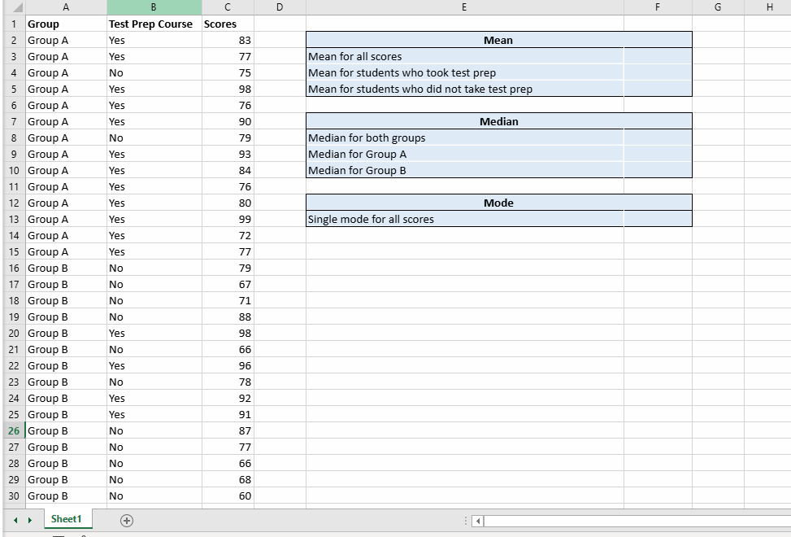
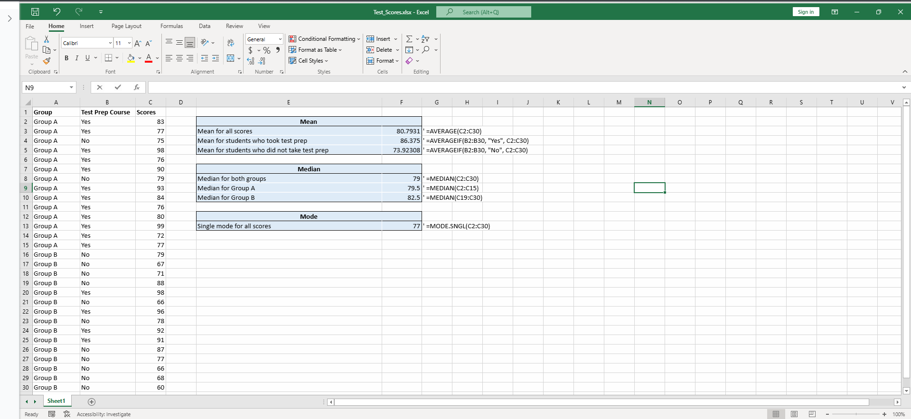

# 11.1.6 Lab: Using the Measures of Central Tendency

---

### 🎯 วัตถุประสงค์ของแล็บเชิงลึก (Deep Dive Objective)

การทดลองนี้ไม่ใช่แค่การเรียนรู้วิธีกดสูตรใน Excel แต่เป็นการปูพื้นฐาน **Descriptive Statistics (สถิติเชิงพรรณนา)** ซึ่งเป็นก้าวแรกที่สำคัญที่สุดในการทำความเข้าใจพฤติกรรมของชุดข้อมูล เป้าหมายหลักคือ:
*   **พิสูจน์สมมติฐาน (Hypothesis Testing):** เพื่อตอบคำถามทางธุรกิจหรือการศึกษาว่า *"การเข้าเรียน Test Prep มีผลต่อคะแนนสอบอย่างมีนัยสำคัญหรือไม่?"* ผ่านหลักฐานเชิงประจักษ์ (Data-Driven)
*   **ค้นหาตัวแทนของข้อมูล (Finding the Representative):** เรียนรู้วิธีเลือก "ค่ากลาง" ที่เหมาะสมที่สุดมาเป็นตัวแทนของข้อมูลแต่ละกลุ่ม เพื่อให้การเปรียบเทียบมีความยุติธรรมและไม่บิดเบือนความจริง

  
---

### 🛠️ เจาะลึกกระบวนการทางเทคนิค (Technical Execution Details)

การใช้ Spreadsheet ใน Lab นี้ได้สะท้อนทักษะ **Data Manipulation** เบื้องต้น ดังนี้:

*   **การจัดการโครงสร้างข้อมูล (Data Structuring):** การแบ่งข้อมูลเป็นคอลัมน์หมวดหมู่ (Categorical Variables เช่น Group A/B, Test Prep Yes/No) และคอลัมน์ตัวเลขเชิงปริมาณ (Quantitative Variables เช่น คะแนนสอบ) เป็นรากฐานของการทำ Data Profiling 
*   **การประมวลผลแบบมีเงื่อนไข (Conditional Aggregation):** 
    *   การใช้ฟังก์ชัน **`=AVERAGEIF(range, criteria, [average_range])`** เป็นการจำลองตรรกะแบบ If-Then ในการดึงข้อมูลเฉพาะกลุ่มออกมาคำนวณ เทคนิคนี้สำคัญมากเพราะในโลกการทำงานจริง ข้อมูลมักจะรวมกันเป็นก้อนใหญ่ (Raw Data) และเราต้องแยกส่วน (Slice and Dice) เพื่อหาความสัมพันธ์ซ่อนเร้น
*   **กลไกเบื้องหลังการหาค่ากลาง (Behind the Formulas):**
    *   **`=MEDIAN()`:** สอนให้รู้ว่าระบบต้องทำการเรียงลำดับข้อมูลจากน้อยไปมาก (Sorting) ก่อนเสมอ เพื่อหาจุด Percentile ที่ 50 (P50) ซึ่งเป็นตำแหน่งกึ่งกลางพอดี
    *   **`=MODE.SNGL()`:** เน้นการหาค่าฐานนิยมแบบค่าเดียว (Unimodal) ซึ่งบอกเราว่าระดับคะแนนใดคือ "ความถี่สูงสุด" หรือมาตรฐานที่คนส่วนใหญ่ทำได้ หากชุดข้อมูลมีจุดยอดหลายจุด อาจต้องพิจารณาใช้ฟังก์ชันอื่นเพิ่มเติม
      
---

### 🧠 สิ่งที่ได้เรียนรู้

**1. การสำรวจข้อมูลเชิงลึกและการกระจายตัว (Data Exploration & Distribution - Obj 2.2)**
*   **ความอ่อนไหวต่อ Outlier (Sensitivity to Outliers):** ค่าเฉลี่ย (Mean) นำทุกค่ามาหารรวมกัน หากมีนักเรียนที่ได้คะแนน 0 หรือได้คะแนนเต็ม 100 โดดขึ้นมา จะดึงให้ค่าเฉลี่ยขยับตามทันที (เรียกว่าเกิดความเบ้ หรือ Skewness)
*   **การใช้ Mean คู่กับ Median เพื่อหา "รูปทรงข้อมูล":**
    *   ถ้า **Mean > Median**: ข้อมูลมักจะ **เบ้ขวา (Right-Skewed)** (มีค่าสูงผิดปกติบางค่าดึงค่าเฉลี่ยขึ้นไป)
    *   ถ้า **Mean < Median**: ข้อมูลมักจะ **เบ้ซ้าย (Left-Skewed)** (มีค่าต่ำผิดปกติบางค่าฉุดค่าเฉลี่ยลงมา)
    *   ถ้า **Mean ≈ Median**: ข้อมูลมีการแจกแจงแบบ **ปกติ (Normal Distribution)** รูปทรงระฆังคว่ำ
*   *ข้อคิดเพิ่มเติม:* ในสายงาน AI/Machine Learning "ค่ากลาง" เหล่านี้คือเครื่องมือสำคัญที่ใช้ในการจัดการค่าว่าง (Missing Value Imputation) การเลือกใช้ให้ถูกบริบทจึงส่งผลต่อความแม่นยำของโมเดลโดยตรง

**2. การวิเคราะห์แบบเปรียบเทียบ (Comparative & Conditional Analysis)**
*   **รากฐานของการทำ A/B Testing:** การแบ่งกลุ่มนักเรียนเป็น "เรียน (Yes)" และ "ไม่เรียน (No)" คือรูปแบบพื้นฐานของการทำ Control Group vs. Experimental Group เราสามารถเห็น Insight ทันทีว่า Test Prep สร้างผลกระทบเชิงบวก (Impact) ต่อผลลัพธ์การสอบได้จริง ช่วยให้ผู้มีอำนาจตัดสินใจ (Stakeholders) พิจารณาลงทุนในคอร์สเรียนนี้เพิ่มเติมได้

**3. การสื่อสารข้อมูลอย่างมีประสิทธิภาพ (Data Communication - Obj 3.1)**
*   **ลดความซับซ้อน (Simplification):** ข้อมูลดิบหลายร้อยบรรทัดไม่มีประโยชน์หากไม่ถูกสรุป การสร้าง Summary Table คือการเปลี่ยน "Data" ให้กลายเป็น "Information" 
*   **การออกแบบเพื่อตอบคำถาม (Design for Action):** ตารางสรุปที่ดีต้องทำให้ผู้บริหารมองเห็น "ความแตกต่าง (Delta)" ระหว่างกลุ่ม A/B หรือกลุ่ม Yes/No ได้ในเวลาไม่เกิน 5 วินาที โดยไม่ต้องสนใจขั้นตอนการคำนวณ

**4. ความแม่นยำทางระบบและตรรกะ (System Precision & Logic)**
*   **Garbage In, Garbage Out (GIGO):** การอ้างอิงช่วงเซลล์ (Cell Reference) ผิดพลาดเพียงแถวเดียว หรือการลืมล็อคเซลล์ (Absolute Reference `$A$1`) เมื่อทำการคัดลอกสูตร สามารถทำให้ Insights ทั้งหมดผิดเพี้ยน แล็บนี้จึงสอนเรื่อง **Data Quality & Validation** ซึ่งต้องอาศัยความละเอียดรอบคอบเป็นอย่างมากก่อนจะนำผลลัพธ์ไปนำเสนอ
